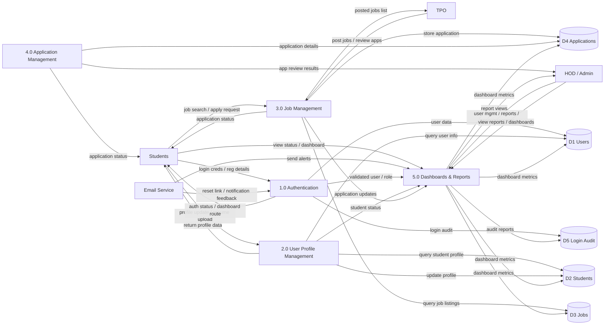

# System Architecture — Novasphere Placement Portal

## 1. High-level Architecture (Component/DFD view)
The following 1-level data flow diagram describes how Students, TPO, HOD/Admin and the Email service interact with the portal’s backend processes and data stores.

> Source in repo: `placement/data_flow_diagrams.md`

## 2. Backend Modules mapped to architecture processes
(derived from `placement/app.py`)

- **1.0 Authentication** (`/login/student`, `/login/admin`, `/logout`, `/reset_password`)
  - Issues JWT (stored in cookies) and applies role-based access checks.
  - Records login audit details into `LoginDetail`.

- **2.0 User Profile Management** (`/register/student`, `/student_profile`, avatar/resume uploads)
  - Stores Student profile data and resume path.

- **3.0 Job Management** (`/post_job`, `/update_job_form`, `/delete_job`, dashboard listing)
  - Creates and updates job drives with deadlines and eligibility constraints.

- **4.0 Application Management** (`/apply_job`, `/submit_secondary_data`, `/update_application_status`)
  - Creates Applications and updates statuses.
  - Triggers notifications (email) on status change.

- **5.0 Dashboards & Reports** (`/student_dashboard`, `/hod_dashboard`, `/tpo_dashboard`, `/admin_dashboard`, downloads)
  - Aggregates DB data into dashboards.
  - Generates Excel/PDF applicant reports.
  - Includes analytics charts (Matplotlib → base64).

## 3. External Integrations (as referenced in the system)
- **Email**: password reset + placement/ status update notifications.
- **ATS Analyzer**: resume PDF extraction (`PyPDF2`) and AI analysis (Gemini/Groq depending on flow).
- **Chatbot**: AI endpoint `/chat`.
- **WhatsApp (Whapi)**: `/send-actual-message` sends alerts to department groups.
- **ngrok (UAT)**: makes local Flask app accessible to students for acceptance testing.

