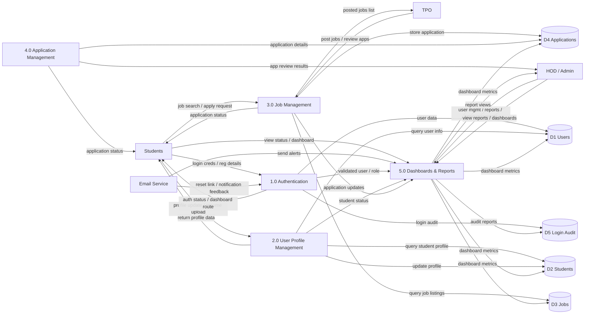

# 1-Level Data Flow Diagram

This 1-level DFD is styled to match the provided image design, with numbered processes, external entities, and data stores.

## Notes

- `1.0 Authentication` handles login, registration, and password reset routing.
- `2.0 User Profile Management` manages student profile details and resume uploads.
- `3.0 Job Management` stores job posts in `D3 Jobs` and sends applications to `4.0 Application Management`.
- `4.0 Application Management` tracks application status and updates staff reviewers.
- `5.0 Dashboards & Reports` aggregates data from the core stores for HOD/Admin/TPO and students.
